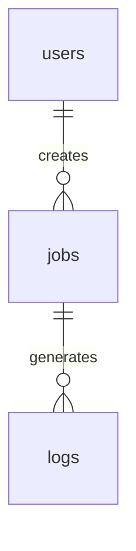

# Data Models

## Entity Relationship Diagram

## Tables

### users
**Description:** Managed by Supabase Auth (auth.users). We reference `id` in our public tables.

### jobs
**Description:** Tracks the status of a scraping request.

| Column/Field | Type | Constraints | Description |
|--------------|------|-------------|-------------|
| id | UUID | PK, Default gen_random_uuid() | Unique Job ID |
| user_id | UUID | FK -> auth.users.id | Who requested the scrape |
| target_url | TEXT | NOT NULL | The Duda website URL |
| status | ENUM | 'pending', 'processing', 'completed', 'failed' | Current state |
| progress | INT | Default 0 | 0-100 percentage |
| storage_path | TEXT | NULLable | Path to ZIP in Supabase Storage |
| error_message| TEXT | NULLable | Failure reason if any |
| created_at | TIMESTAMPTZ | Default now() | Creation time |
| updated_at | TIMESTAMPTZ | Default now() | Last update |

**Access Control (RLS):**
| Operation | Who Can Perform | Condition |
|-----------|-----------------|-----------|
| SELECT | Team Member | `auth.uid() == user_id` |
| INSERT | Team Member | `auth.uid() == user_id` |
| UPDATE | Service Role | (Worker updates status) |

### logs
**Description:** Debug logs for job execution (useful for troubleshooting failed scrapes).

| Column/Field | Type | Constraints | Description |
|--------------|------|-------------|-------------|
| id | BIGINT | PK | Log ID |
| job_id | UUID | FK -> jobs.id | Associated Job |
| level | TEXT | 'info', 'warn', 'error' | Log severity |
| message | TEXT | NOT NULL | Log content |
| created_at | TIMESTAMPTZ | Default now() | Timestamp |

---
⚠️ **AI INSTRUCTION:** When you modify any table/collection, UPDATE THIS FILE IMMEDIATELY before proceeding.
