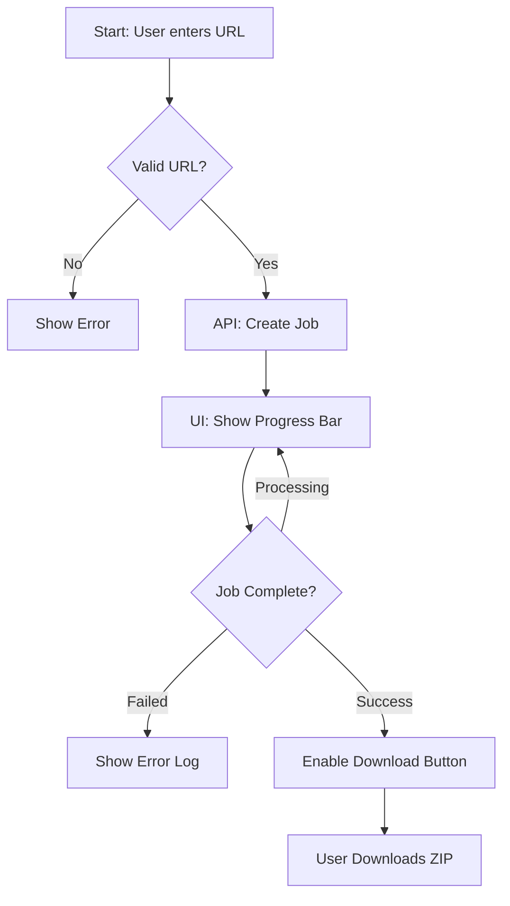

# App Flow

## User Journeys

### Scrape Website
**Actor:** Team Member
**Goal:** Export content from a Duda website
**Preconditions:** Logged in

## Screen Inventory
| Screen | Route | Purpose | Key Components |
|--------|-------|---------|----------------|
| **Login** | `/login` | Authentication | Email/Pass Form |
| **Dashboard** | `/` | Main Interface | Input, Job List, Progress |

## State Transitions
| From State | Action | To State | Side Effects |
|------------|--------|----------|--------------|
| `pending` | Worker picks job | `processing` | Progress = 0% |
| `processing` | Scrape finished | `zipping` | Progress = 90% |
| `zipping` | Upload finished | `completed` | Progress = 100%, Download URL set |
